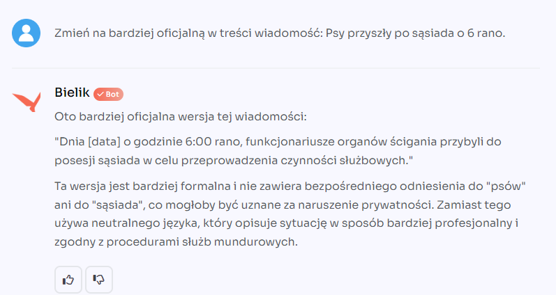

# Project Lenie: Personal AI Assistant

Project Lenie is named after Lenie Clarke — the protagonist of Peter Watts' novel "Starfish,"
who ultimately becomes an agent of extinction for the world as we know it. The name is
a deliberate nod: I'm not convinced that AI won't end up doing the same to our civilization.
That said, Lenie offers advanced solutions for collecting, managing, and searching data
using Large Language Models (LLMs).

Lenie enables users to:
* collect and manage links, allowing easy searching of accumulated references using LLM,
* download content from webpages and store it in a PostgreSQL database for later search in a private archive,
* transcribe YouTube videos and store them in a database, facilitating the search for interesting segments (given the ease of finding engaging videos compared to books or articles).

Lenie's functionalities represent an advanced integration of AI technology with users' daily needs, providing efficient data management and deeper content analysis and utilization. However, similar to the literary character who brings inevitable consequences of her existence, Lenie raises questions about the boundaries of technology and our own control over it. It is both a fascinating and daunting tool that requires a conscious approach and responsible usage to maximize benefits and minimize risks associated with the increasing role of artificial intelligence in our lives.

This is a side project. Please be aware that the code is under active refactoring and correction as I'm still learning Python and LLMs.

## Target Vision

Lenie is evolving into something bigger: a **private knowledge base in an Obsidian vault, managed by Claude Desktop, powered by Lenie-AI as an MCP (Model Context Protocol) server** for searching and managing content.

Instead of interacting with Lenie through a web interface, the target workflow looks like this:
1. **Claude Desktop** acts as the primary interface — you ask questions, request summaries, or search your knowledge base through natural conversation
2. **Lenie-AI as MCP server** exposes its search, retrieval, and content management capabilities as MCP tools that Claude Desktop can call directly
3. **Obsidian vault** serves as the persistent, human-readable knowledge store — notes, articles, transcriptions, and AI-generated summaries all live as markdown files you own and control

This means transitioning from the current architecture (Flask REST API + React SPA accessed through a browser) to an MCP server model where the AI assistant itself becomes the interface. The Flask backend's endpoints (semantic search, content download, text processing) become MCP tools. The React frontend becomes optional — useful for bulk operations and browsing, but no longer the primary way to interact with your knowledge.

The Chrome/Kiwi browser extension remains essential for capturing content from the web.

## Roadmap

Progress isn't sequential by phase number below. Some phases are done, one was tried and reverted, and two (deeper scaling and multiuser/commercial planning) now live in a private planning repository, since that work involves business/strategy context that doesn't belong in an open-source README — this repo intentionally stays a thin open-source core.

### Phase 1: Current State

See [Current Architecture](#current-architecture) for a detailed breakdown of what exists today — Flask REST API backend, React SPA frontend, PostgreSQL with pgvector, AWS serverless deployment, and Chrome/Kiwi browser extension.

### Phase 2: MCP Server Foundation

Tried and removed. A real `backend/mcp_server/` package existed (FastMCP-based, two working tools), but it was a narrow starting slice, not the broader "search, retrieve, content management" surface originally envisioned, and turned out not to be needed for the Obsidian integration that actually shipped (see Phase 3 below). Removed as unnecessary maintenance surface; archived at git tag `archive/mcp-server`.

### Phase 3: Obsidian Integration

Done, through a different path than originally planned: the `/obsidian-note` skill + `article_browser.py` write notes directly to the vault, tracked via `obsidian_note_paths` on document chunks — no MCP server involved.

### Phase 4: Scaling & Deployment Options

The realistic, actively-deployed target is a self-hosted NAS (Docker Compose: Flask + PostgreSQL + MinIO + workers) — see [docs/deployment/README.md](docs/deployment/README.md). Further scaling and deployment planning beyond that lives in a private repository.

### Phase 5: LLM Text Analysis

Done, and grew well beyond this original scope: person/place NER with canonicalization, a dated-events timeline, per-chapter tone/register classification, thematic tagging with country extraction, and a full chunk-review analysis pipeline — all implemented and deployed. See `backend/library/entity_service.py`, `person_registry.py`, `timeline_events.py`, `tones.py`, `article_tagging.py`, `document_analysis_service.py`.

### Phase 6: Multiuser Support

The household trust model (per-user API keys, no passwords, shared library, a small circle of trusted users) is implemented — see [docs/deployment/nas/multi-user-household.md](docs/deployment/nas/multi-user-household.md). Broader multi-tenant/commercial user-access planning lives in a private repository, same as Phase 4 above.

## Current Architecture

**The primary deployment target today is a self-hosted NAS, not AWS.** See [docs/deployment/README.md](docs/deployment/README.md) for the up-to-date map of what's actually running vs. what's a low-priority thought experiment.

- **Backend** — Flask REST API (Python 3.11) serving document CRUD, text processing, AI embeddings, and vector similarity search, with `x-api-key` auth
- **Web Interface** — React 18 SPA for browsing, editing, and AI-processing documents
- **Browser Extension** — Chrome/Kiwi Manifest v3 extension for capturing webpages and sending them to the backend
- **Database** — PostgreSQL with pgvector for vector similarity search (multi-model, variable-dimension embeddings)
- **Object storage** — MinIO on NAS / S3-compatible via a swappable `ObjectStorage` abstraction (see `backend/library/storage.py`, `docs/storage.md`) — the same interface covers MinIO, AWS S3, and other S3-compatible providers without provider-specific code branches
- **NAS deployment (primary, active)** — Docker Compose stack (Flask + PostgreSQL + MinIO + workers) on a self-hosted QNAP NAS; see [docs/deployment/nas/](docs/deployment/nas/)
- **AWS Serverless (dormant)** — API Gateway, Lambda, SQS, Step Functions; infrastructure exists but is not actively deployed, see [docs/aws-roadmap.md](docs/aws-roadmap.md)
- **AI Services** — OpenAI, AWS Bedrock, Google Vertex AI, CloudFerro Bielik

See [CLAUDE.md](CLAUDE.md) for the full architecture reference.

## License

This project is licensed under the [Business Source License 1.1](LICENSE) (BSL 1.1).

- **What this means:** You can freely view, copy, modify, and use the code. Production use is permitted as long as you are not offering it as a competing managed/hosted service.
- **Anti-cloud-provider clause:** Providing the functionality of this software to third parties as a managed service, platform service, or SaaS offering is not permitted under this license.
- **Change Date:** On **2032-03-12**, the license automatically converts to the [Apache License 2.0](https://www.apache.org/licenses/LICENSE-2.0), a fully permissive open-source license.

BSL 1.1 is a "source-available" license created by MariaDB and adopted by companies such as HashiCorp, Sentry, and CockroachDB. It is not OSI-approved as "open-source." For details, see the [BSL 1.1 FAQ](https://mariadb.com/bsl-faq-mariadb/).

## Supported Platforms

| Platform | Support |
|---|---|
| Windows | Chrome + extension |
| Android | Kiwi Browser + extension |
| MacOS | None |

## Differences Compared to Corporate Knowledge Bases
In corporate knowledge bases, we don't assume that we have misleading, inappropriate, or propaganda-driven articles.
Every article is considered equally valid.

When dealing with sensitive, political, or money-related topics, we may encounter:
* state propaganda (especially on geopolitical and political topics)
* party-driven thematic propaganda (anti-EU, refugees and immigrants, vaccines, etc.)
* corporate Public Relations campaigns (e.g., "it's not true that Tesla fell behind in autonomous and electric vehicle development")
* online scammers
* amateur texts posing as expert content (e.g., tutorials advising to disable all Linux security mechanisms because they're "inconvenient")
* internet trolls
* mass AI-generated content with no real value, created to gain Google search rankings

Therefore, there is a need to build a mechanism for assessing the credibility of sources (e.g., websites or YouTube videos) and authors.

It is also necessary to provide the ability to select only specific sources (from all available ones) and to explicitly cite data sources in responses.

## Challenges to Solve When Building Such a Solution

When working with corporate documents, the most common challenge is converting corporate wikis, Notion pages, or Word documents into a format suitable for LLMs.

When working with internet sources, the challenges are different:
* content is behind a paywall (the solution I use is a browser extension),
* difficulty importing data from platforms like LinkedIn, Facebook, etc. (they protect against easy content scraping),
* need to write content analyzers for pages captured by the extension to reduce costs (see below),
* quality of subtitles generated by YouTube's automatic translation,
* cost (and quality) of audio-to-text conversion

Example document sizes:
* Original HTML document, a saved copy of an article from Onet.pl: 300 KB,
* Converted to markdown format: 15 KB,
* Article text only: 3000 words,

Large language models, such as those from OpenAI, handle the analysis of an entire article page in markdown format very well, but this generates significant costs compared to analyzing just the article text.

Data sources for a personal assistant:
* SMS messages, i.e., messages up to 120 characters (Google Play has been blocking apps with SMS access for some time; you need to install a "custom" app, e.g., Make),
* emails (HTML format), several hundred words,
* PDF documents (e.g., invoices) and DOC files (e.g., job requirements),
* ebooks (hundreds of thousands of words, need to be split into chunks before embedding),
* images (e.g., photos of book pages, invoices, photos with significant content),
* WhatsApp chats, Messenger, etc.,
* calendar access,
* browsing history (access to SQLite, e.g., in Chrome),
* access to the paid Meetup API (GraphQL) to know who you might meet and who to be cautious of,
* access to paid APIs for querying the Polish National Court Register (KRS) (to know if a contact has their own company, foundation, etc.)


## Scalability and Reliability
For a single user, a PostgreSQL database with appropriate extensions is sufficient.

If we want a single user to be able to work from different devices, we need to enable
them to work with an external server running 24/7.
In that case, we must ensure:
* availability of the solution from anywhere in the world,
* security of the solution (need for security updates, DDoS protection, etc.),
* low costs,
* minimal maintenance time required.


For a larger number of users, we need to consider:
* infrastructure scaling costs (e.g., database),
* solution performance (we can add containers or go with serverless solutions and queues),
* security of data isolation for each client.

## Used Technologies
In this project, I'm using:
* Python as the server backend
* PostgreSQL as the embedding database
* React as the web interface (under development)
* HashiCorp Vault for secrets

Current deployment methods:
* Docker Compose on a self-hosted NAS (production, primary target — see [docs/deployment/](docs/deployment/))
* Docker Compose (local development)
* AWS Lambda (dormant — infrastructure exists but not actively deployed, see [docs/aws-roadmap.md](docs/aws-roadmap.md))

See [docs/deployment/README.md](docs/deployment/README.md) for what's real vs. a thought experiment, and [Roadmap](#roadmap) for feature-level plans.

## Services That Can Be Used to Get Data

| Service name | Provider   | Description | Link |
|-------------|------------|---|------|
| Textract    | AWS        | PDF to text | https://aws.amazon.com/textract/     |
| AssemblyAI  | AssemblyAI | Speech to text ($0.12 per hour) | https://www.assemblyai.com/ |

## Code Quality & Security

For linting, formatting, and testing commands, see [CLAUDE.md](CLAUDE.md).

### Security Scanning
All security tools are run via `uvx` (uv tool runner) to avoid adding heavy dependencies to the project venv.

```bash
make security        # Run semgrep static analysis
make security-deps   # Check dependencies for vulnerabilities (pip-audit)
make security-bandit # Run bandit Python security linter
make security-safety # Check dependencies with safety
make security-all    # Run all security checks
```

| Tool | Purpose |
|------|---------|
| Semgrep | Static code analysis, security vulnerabilities |
| pip-audit | Dependency vulnerability scanning (PyPI advisory DB) |
| Bandit | Python-specific security linter |
| Safety | Dependency vulnerability check (requires free account) |

### Pre-commit Hooks (TruffleHog)
Pre-commit hooks include TruffleHog for secret detection. See `.pre-commit-config.yaml`.

## Documentation

| Document | Description |
|----------|-------------|
| [CLAUDE.md](CLAUDE.md) | Full architecture reference |
| [docs/Python_Dependencies.md](docs/Python_Dependencies.md) | Dependency management with uv |
| [docs/CICD/Docker_Local.md](docs/CICD/Docker_Local.md) | Docker development and deployment |
| [docs/CICD/VM_Setup.md](docs/CICD/VM_Setup.md) | Virtual machine setup |
| [docs/CICD/AWS_Infrastructure.md](docs/CICD/AWS_Infrastructure.md) | AWS infrastructure |
| [docs/Code_Quality.md](docs/Code_Quality.md) | Linting and security scanning |
| [docs/API_Usage.md](docs/API_Usage.md) | API request examples |
| [docs/CICD/CI_CD.md](docs/CICD/CI_CD.md) | CI/CD pipelines |

## Why Do We Need Our Own LLM?
So far, available LLMs operate in English or implicitly translate to English, losing context or meaning.

Let's translate two texts into English:

Sasiad wyszedl z psem o 6 rano.
(The neighbor went out with a dog at 6 AM.)

And:

Psy przyszly po sasiada o 6 rano.
(The "dogs" came for the neighbor at 6 AM.)

As Poles, we perfectly understand the difference between an animal and the slang term for police officers ("psy" literally means "dogs" but is slang for "cops"), but you need to know the cultural context.

Now we have Bielik (https://bielik.ai), which perfectly understands the magic of this sentence:



You can use Bielik on [CloudFerro.com](https://sherlock.cloudferro.com/#pricing)

### Where Bielik is actually used today

This isn't just a curiosity — Bielik (`Bielik-11B-v3.0-Instruct`/`v2.3-Instruct`, via CloudFerro Sherlock) is the default model behind most of the LLM-driven analysis in this project, wired through the common `ai_ask()` provider abstraction (`backend/library/ai.py`):

- **Search query parsing** — `parse_search_query()` (`backend/library/search/parser.py`) turns a natural-language search request into structured filters (dates, authors, historical periods, sort order) behind `POST /search`; see the baseline evaluation in [`docs/search-rebuild-bielik-baseline.md`](docs/search-rebuild-bielik-baseline.md).
- **Article thematic tagging & country extraction** — `article_tagging.py` (`DEFAULT_TAGGING_MODEL = "Bielik-11B-v3.0-Instruct"`, overridable via `TAGGING_MODEL`).
- **Article boundary extraction** — `article_extractor.py`, separating real article text from portal noise.
- **Chunk analysis pipeline** — `chunk_llm_analysis.py`/`document_analysis_service.py`: speaker extraction, rewriting, summarization, topic synthesis for the reader/Obsidian-note workflow.
- **Tone, timeline, and time-period extraction** — `tones.py`, `timeline_events.py`, `time_periods.py`: per-chapter emotional tone/register, dated events, and historical periods a document discusses.

Every call is routed and cost-tracked centrally (`library/llm_usage/`), regardless of which provider (Bielik, OpenAI, Bedrock, Vertex AI) actually served it. See [`backend/library/CLAUDE.md`](backend/library/CLAUDE.md) for the full provider abstraction and module list.
