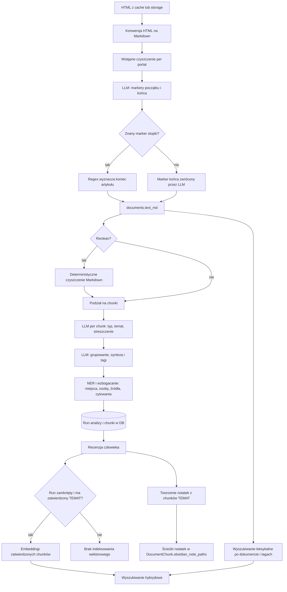
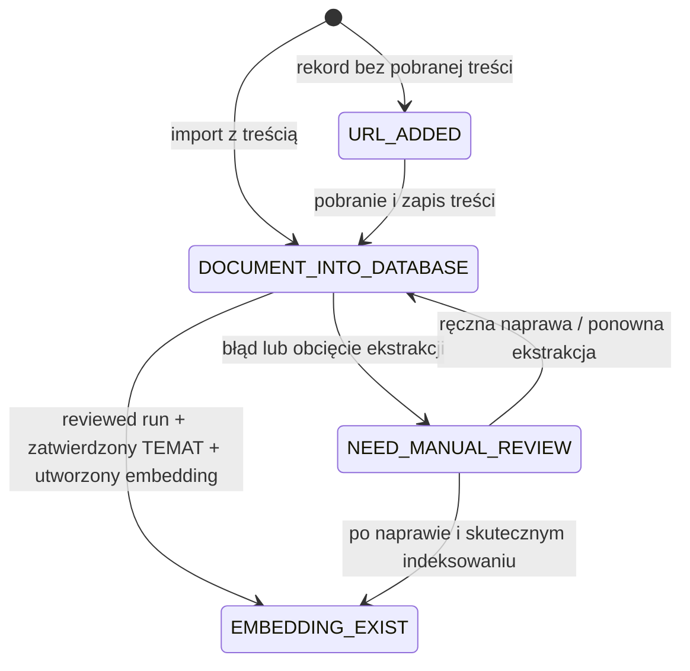
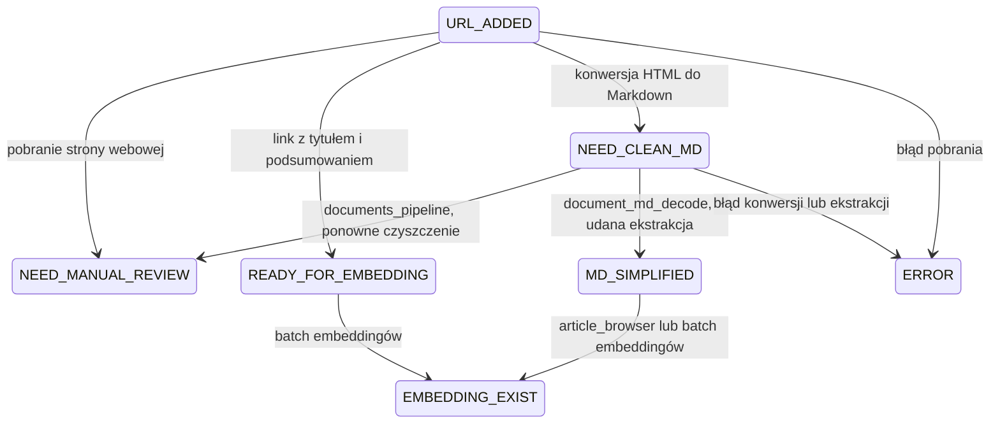
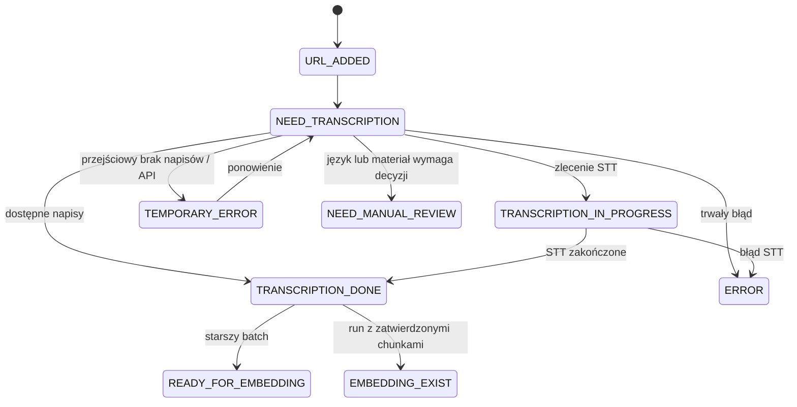

# Jak analizowany jest dokument webowy — pełny flow (timeline funkcji)

Ten dokument opisuje, co dokładnie dzieje się z artykułem/stroną webową od momentu pobrania
do momentu, w którym jego treść jest przeszukiwalna (embeddingi + tagi). Każdy krok jest
funkcją konkretnego pliku (`plik.py:LINIA`), w kolejności w jakiej faktycznie się wykonuje,
z opisem co robi na wejściu/wyjściu i oznaczeniem mechanizmu:

- **REGEX** — deterministyczny kod (Python/regex), zero kosztu, w pełni powtarzalny
- **LLM** — wywołanie Bielika (Sherlock/ARK Labs), kosztuje, może się mylić
- **SERWIS** — zewnętrzne API/mikroserwis (NER spaCy, LocationIQ, Wikidata) — nie LLM

Stan na 2026-07-22, gałąź `main`. Kod źródłowy jest tu autorytetem — jeśli coś zmienisz
w kodzie, zaktualizuj też ten plik (i linie, które na pewno się przesuną).

## Skrót w jednym zdaniu

```
pobranie HTML → wyciągnięcie treści artykułu (LLM markery + regex per-portal)
  → utworzenie "run"-a analizy → deterministyczne czyszczenie → podział na chunki
  → klasyfikacja/streszczenie chunków (LLM) → grupowanie w sekcje (LLM)
  → tagowanie + NER + miejsca + osoby + jakość → recenzja człowieka
  → embeddingi (automatycznie po zamknięciu) → wyszukiwanie hybrydowe
```



### Trzy niezależne osie stanu

Pipeline nie ma jednego wspólnego statusu. Te trzy osie zmieniają się niezależnie i nie należy
zapisywać stanu notatek jako kolejnej wartości `Document.processing_status`:

| Oś | Pole / źródło | Przykładowe stany |
|---|---|---|
| Techniczne przetwarzanie dokumentu | `Document.processing_status` | `DOCUMENT_INTO_DATABASE` → `EMBEDDING_EXIST` |
| Analiza i recenzja | `DocumentAnalysisRun.status`, `DocumentChunk.status` | run: `created` → `in_review` → `reviewed`; chunk: `pending` → `approved` / `skipped` |
| Notatki Obsidian (stan pochodny) | aktywne chunki `TEMAT` + `DocumentChunk.obsidian_note_paths` | `BRAK_NOTATEK`, `CZĘŚCIOWE`, `KOMPLETNE`, `NIE_DOTYCZY` |

Stan notatek jest wyliczany, a nie przechowywany jako osobny enum:

| Stan | Warunek dla aktywnych chunków `TEMAT` |
|---|---|
| `BRAK_NOTATEK` | istnieje co najmniej jeden chunk bez ścieżki notatki i żaden nie ma notatki |
| `CZĘŚCIOWE` | część chunków ma `obsidian_note_paths`, a część nadal ich nie ma |
| `KOMPLETNE` | nie ma brakujących chunków i co najmniej jeden chunk ma notatkę |
| `NIE_DOTYCZY` | dokument nie ma aktywnych chunków `TEMAT` wymagających notatki |

Do brakujących nie zaliczają się chunki `status="skipped"` ani chunki z runów
`status="superseded"`. Starsza tablica `Document.obsidian_note_paths` nadal sygnalizuje notatki
utworzone na poziomie całego dokumentu, natomiast nowy flow śledzi notatki dokładniej, per chunk.
Repozytorium zwraca już liczniki `chunks_missing_obsidian_notes` i
`chunks_with_obsidian_notes`, z których UI może wyprowadzić powyższy stan bez migracji bazy.

## Mapy `Document.processing_status`

`processing_status` jest starszą maszyną stanów technicznych dokumentu. Nie opisuje postępu
analizy LLM, recenzji chunków ani notatek Obsidian. Obecnie obsługuje kilka nakładających się
pipeline'ów, dlatego nie istnieje jedna poprawna strzałka przechodząca przez wszystkie wartości.

### Nowy flow artykułu z recenzją chunków



Analiza nie ustawia stanu pośredniego `READY_FOR_EMBEDDING`. Jej postęp jest zapisany w
`DocumentAnalysisRun.status` i `DocumentChunk.status`. Dopiero
`generate_embeddings_from_run()` ustawia `EMBEDDING_EXIST`, i tylko gdy zapisano co najmniej
jeden embedding.

### Starszy flow Markdown / batch



W tym flow `READY_FOR_EMBEDDING` jest nadal aktywnym kontraktem kolejki. Metoda
`DocumentRepository.get_documents_needing_embedding()` wybiera dokumenty bez embeddingu w
stanach `READY_FOR_EMBEDDING`, `MD_SIMPLIFIED` i — w celu regeneracji — `EMBEDDING_EXIST`.
Celowo nie wybiera `DOCUMENT_INTO_DATABASE`, bo taki dokument może nadal czekać na recenzję
chunków.

### YouTube / transkrypcja



### Inwentaryzacja stanów

| Stan | Status w kodzie | Obecna rola |
|---|---|---|
| `URL_ADDED` | aktywny | Punkt wejścia bez treści; kolejka pobierania i YouTube. |
| `DOCUMENT_INTO_DATABASE` | aktywny | Import ma już treść; nowy flow może czekać na analizę i recenzję. |
| `NEED_MANUAL_REVIEW` | aktywny | Stan wyjątkowy: brak danych, nieudana/obcięta ekstrakcja albo decyzja człowieka. Nie jest normalnym etapem sukcesu. |
| `READY_FOR_EMBEDDING` | aktywny, starszy flow | Jawna kolejka batchowa dla linków, oczyszczonych dokumentów i transkrypcji. |
| `MD_SIMPLIFIED` | aktywny, starszy flow | Oczyszczony Markdown gotowy do starszego indeksowania. |
| `NEED_CLEAN_MD` | aktywny, starszy flow | Kolejka czyszczenia Markdown. |
| `EMBEDDING_EXIST` | aktywny | Co najmniej jeden embedding został utworzony; nie gwarantuje kompletności notatek ani zakończonej recenzji wszystkich runów. |
| `ERROR` | aktywny | Trwały błąd; szczegół znajduje się w `processing_error_code`. |
| `TEMPORARY_ERROR` | aktywny dla YouTube | Błąd nadający się do ponowienia. |
| `NEED_TRANSCRIPTION` | aktywny dla YouTube | Materiał oczekuje na napisy lub STT. |
| `TRANSCRIPTION_IN_PROGRESS` | aktywny dla YouTube | Zewnętrzne STT pracuje. |
| `TRANSCRIPTION_DONE` | aktywny dla YouTube | Transkrypcja gotowa; dalszy krok zależy od nowego lub starszego flow. |
| `TEXT_TO_MD_DONE` | alias historyczny | Wejście o tej nazwie jest mapowane na `NEED_CLEAN_MD`; kod nie zapisuje tego stanu. |
| `NEED_CLEAN_TEXT` | prawdopodobnie legacy | Brak aktywnego producenta i konsumenta poza ogólnym filtrowaniem po statusie. |
| `TRANSCRIPTION_DONE_AND_SPLIT_BY_CHAPTERS` | prawdopodobnie legacy | Pozostaje w enumie i słowniku DB, ale bieżący pipeline nie zapisuje tego stanu. |

## Co trzeba uporządkować

Poniższa kolejność minimalizuje ryzyko usunięcia stanu, który nadal trzyma historyczne rekordy
lub zasila starszy skrypt:

1. **Zmierzyć dane produkcyjne.** Policzyć dokumenty w każdym `processing_status`, ich typy,
   ostatnią zmianę oraz obecność tekstu, runów i embeddingów. Bez tego nie usuwać wartości ze
   słownika DB.
2. **Wybrać jeden właścicielski pipeline artykułów.** Obecnie nowy flow
   `DocumentAnalysisService` współistnieje z `documents_pipeline.py`, `document_md_decode.py` i
   bezpośrednim embeddingiem w `article_browser.py`.
3. **Ustalić semantykę `EMBEDDING_EXIST`.** Dziś oznacza „utworzono co najmniej jeden embedding”,
   nie „indeks jest kompletny i aktualny”. Regeneracja usuwa i tworzy embeddingi partiami, więc
   warto rozważyć osobny job/status indeksowania zamiast przeciążać stan dokumentu.
4. **Zdecydować o `READY_FOR_EMBEDDING`.** Albo nowy flow zaczyna jawnie ustawiać ten stan po
   recenzji, albo stan pozostaje wyłącznie kontraktem legacy i zostaje później usunięty razem ze
   starszym batchem. Nie łączyć obu znaczeń bez migracji.
5. **Usunąć pozostałe stany potwierdzone jako martwe.** Pipeline tłumaczenia usunięto w migracji
   `d18f4a6b2c7e`. Pozostali kandydaci: `TEXT_TO_MD_DONE`, `NEED_CLEAN_TEXT`,
   `TRANSCRIPTION_DONE_AND_SPLIT_BY_CHAPTERS`. Wymaga to
   migracji istniejących rekordów, enumu, `PROCESSING_STATUS_LOOKUP`, tabeli
   `processing_status_types`, testów i klientów API.
6. **Nie dodawać Obsidiana do `processing_status`.** Udostępnić w API jeden wyliczony
   `obsidian_status` na podstawie istniejących liczników, aby frontend i CLI nie implementowały
   różnych reguł `BRAK_NOTATEK` / `CZĘŚCIOWE` / `KOMPLETNE` / `NIE_DOTYCZY`.
7. **Rozdzielić błędy od etapów.** `NEED_MANUAL_REVIEW`, `ERROR` i `TEMPORARY_ERROR` są odnogami,
   a nie kolejnymi krokami sukcesu. Dokumentacja i UI powinny pokazywać je jako wyjątki z
   `processing_error_code`.
8. **Dodać testy dozwolonych przejść.** Obecny enum ogranicza wartości, ale nie blokuje np.
   bezpośredniego nadpisania dowolnego stanu na `EMBEDDING_EXIST`. Centralna funkcja przejścia
   powinna logować źródło i odrzucać niedozwolone zmiany.

---

## Pliki tymczasowe i S3 (cache dokumentu)

Cały import (Część 1) operuje na katalogu cache **per dokument**:
`{CACHE_DIR}/markdown/{document_id}/` (`CACHE_DIR` z configu, domyślnie `tmp` —
`imports/dynamodb_sync.py:450`). W nim, w kolejności powstawania:

| Plik | Kto tworzy | Co zawiera |
|---|---|---|
| `{document_id}_info.json` | `article_pipeline.py: ensure_raw_markdown()` → `document_prepare.py: save_document_info()` | Metadane dokumentu (id, url, title, language, uuid, ingested_at, typ, status) — zapisywane PRZED pobraniem HTML. |
| `{document_id}.html` | `document_prepare.py: prepare_markdown()` | Surowy HTML strony. Jeśli już jest w cache — używany bez pobierania. Jeśli brak — **pobierany z S3** (patrz niżej). |
| `{document_id}.md` | `document_prepare.py: prepare_markdown()` | Markdown po konwersji HTML→MD. Trzy próby konwertera w kolejności, każda kolejna tylko gdy poprzednia dała redukcję rozmiaru <30%: `MarkItDown` → `html2markdown` → `html2text`. |
| `{document_id}_step_1_all.md` | `article_pipeline.py: ensure_raw_markdown()` | **To ten sam tekst co `{document_id}.md`**, zapisany powtórnie pod inną nazwą (`step1_path()`) — historyczna konwencja nazewnicza, dwa pliki z identyczną zawartością na dysku. |
| `{document_id}_llm_extracted_article.md` | `article_extractor.py: process_article_with_llm_fallback()` | Finalny tekst artykułu po zastosowaniu markerów LLM (krok 11 tabeli niżej). |
| `{domain}_{document_id}.regex.draft` | `article_extractor.py: generate_regex_draft()` | Szkic reguły regex (kontekst 5 linii przed/po granicach) do ręcznego dopisania nowego portalu. |
| `{domain}_{document_id}_llm_markers.json` | `article_extractor.py: generate_regex_draft()` | Surowe markery zwrócone przez LLM + numery linii — metadane obok draftu. |

**Skąd bierze się HTML, gdy nie ma go w cache**: `document_prepare.py: prepare_markdown()`
sprawdza najpierw `s3_file_exist()`, potem pobiera przez `s3_take_file()` z bucketu configu
`AWS_S3_WEBSITE_CONTENT`, pod kluczem **`{doc.uuid}.html`** (nie `{document_id}.html` —
S3 jest kluczowany po UUID dokumentu, cache lokalny po numerycznym ID). Brak HTML w S3 →
`None`, cały import się zatrzymuje (log: "HTML nie znaleziony w S3").

---

## Ogólne vs specyficzne dla portalu — mapa pokrycia

Portal jest rozpoznawany **raz**, przez `_detect_portal(url)` (`article_extractor.py:72`) —
ta sama funkcja jest reużywana i w imporcie, i w reclean (`article_cleaner.py` importuje ją
wprost, linia 15). Rozpoznaje: `onet` (+ fakt.pl), `money`, `wp` (+ o2.pl), `interia`,
`businessinsider`, `natgeo`, `gazeta`, `bankier`. **Wyjątek:** `ithardware.pl` jest
sprawdzany osobno, substring na URL wprost w `clean_article_text()` (`article_cleaner.py:823`)
— nie przechodzi przez `_detect_portal()`, więc dla tego serwisu funkcja portal-detekcji
zwróci `None`, ale reclean i tak dostanie dedykowane czyszczenie.

Pokrycie **nie jest jednolite** — różne portale mają różny zestaw reguł na różnych etapach:

| Portal | Import: marker stopki | Import: marker startu nawigacji | Import: sekcje premium | Import: linie-śmieci | Reclean: `_clean_lines_*()` |
|---|:-:|:-:|:-:|:-:|:-:|
| onet / fakt.pl | ✓ | – | ✓ | ✓ | ✓ `_clean_lines_onet` + `_strip_leading_onet_ai_summary` |
| money.pl | ✓ | – | – | ✓ | ✓ `_clean_lines_money` (+ `_remove_author_bio_paragraph`) |
| wp.pl / o2.pl | ✓ | ✓ | – | ✓ | ✓ `_clean_lines_wp` (+ `_remove_author_bio_paragraph`) |
| interia.pl | ✓ | – | – | ✓ | ✓ `_clean_lines_interia` + `_strip_interia_chrome_blocks` |
| businessinsider.com.pl | ✓ | – | – | ✓ | – (tylko `_clean_lines_generic`) |
| national-geographic.pl | ✓ | – | ✓ | ✓ | – (tylko `_clean_lines_generic`) |
| gazeta.pl | ✓ | – | – | – | ✓ `_clean_lines_gazeta` |
| bankier.pl | ✓ | ✓ | – | – | ✓ `_clean_lines_bankier` |
| ithardware.pl | – (poza `_detect_portal`) | – | – | – | ✓ `_clean_lines_ithardware` (wykrywany osobno) |
| każdy inny/nieznany | – | – | – | – | tylko `_clean_lines_generic` |

Które etapy pipeline'u (Część 1 i 2) są **w ogóle** świadome portalu, a które są **w pełni
generyczne** (identyczne dla każdego dokumentu, niezależnie od portalu):

| Etap | Ogólny czy portal-specyficzny? |
|---|---|
| Pobranie HTML, konwersja do markdown | w pełni ogólny |
| `_trim_markdown_navigation` | ogólny (szuka ostatniego H1, nie zależy od portalu) |
| `_clean_markdown_for_llm` / `_cut_at_footer` (import) | **portal-specyficzny** — patrz tabela wyżej |
| Ekstrakcja markerów przez LLM | ogólny prompt, ten sam dla każdego portalu |
| Wyznaczenie finalnych granic (`extract_article_by_markers`) | **portal-specyficzny dla końca** (regex marker), ogólny dla początku (zawsze LLM) |
| Autor — ekstrakcja deterministyczna (import) | **portal-specyficzny — onet.pl oraz wp.pl/o2.pl/money.pl** (`article_metadata.py`); pozostałe portale polegają na fallbacku LLM (13/11b2) |
| `clean_article_text` (reclean, Część 2 krok 3) | **portal-specyficzny** — patrz tabela wyżej |
| Data publikacji z artefaktu względnego | ogólny (dopasowuje wzorce "wczoraj"/"N godzin temu" niezależnie od portalu) |
| Biogram autora (`extract_trailing_author_biography`) | ogólny heurystyk (sygnały językowe), bez słownika portali — mimo że przypadek testowy/motywujący był wp.pl/o2.pl |
| podział na chunki, klasyfikacja LLM, sekcje, synteza, tagowanie, autor-fallback, NER, miejsca, osoby, źródła, cytowania | w pełni ogólne, zero świadomości portalu |
| Ocena staranności (`compute_quality`) | **w większości ogólny, z jednym wyjątkiem**: `PUBLISHER_OWN_AGENCIES` (`article_quality.py:82-90`) rozpoznaje własną agencję fotograficzną wydawcy (Agencja Wyborcza.pl na domenach `wyborcza.pl`/`gazeta.pl`/`wyborcza.biz`/`wysokieobcasy.pl`/`tokfm.pl` — grupa Agora) i obniża wagę takiego podpisu zdjęcia do 0, zamiast liczyć go jako "obcą" agencję. To OSOBNY, trzeci słownik portalowy — niezależny od `_detect_portal()`. |
| Embeddingi, wyszukiwanie | w pełni ogólne |

---

## Część 1 — Import: od HTML do `documents.text_md`

Dzieje się **raz**, przy dodaniu dokumentu (`imports/dynamodb_sync.py`,
`imports/article_browser.py`, rozszerzenie Chrome) — przed pierwszym kliknięciem
"Rozpocznij analizę" na `/chunks`. Wejście: `library/article_pipeline.py: extract_article()`.

| # | Funkcja | Plik:linia | Co robi | Mechanizm |
|---|---|---|---|---|
| 1 | `ensure_raw_markdown()` | `article_pipeline.py:24` | Zwraca surowy markdown CAŁEJ strony. Czyta `{id}_step_1_all.md` z cache jeśli już istnieje; inaczej pobiera HTML (cache/S3) i konwertuje przez `prepare_markdown()` (MarkItDown/html2text), zapisuje do cache. | REGEX/deterministyczne |
| 2 | `process_article_with_llm_fallback()` | `article_extractor.py:656` | Orkiestruje kroki 3-8 poniżej + retry (2 próby) + fallback między dostawcami LLM (ARK Labs ↔ CloudFerro). Zwraca wyekstrahowany tekst artykułu albo `None`. | orkiestracja |
| 3 | `_detect_portal(url)` | `article_extractor.py:72` | Rozpoznaje portal po URL (`onet`/`money`/`wp`/`interia`/`businessinsider`/`natgeo`/`gazeta`/`bankier`/`None`). Steruje którym słownikiem markerów (4, 6) użyć niżej. | REGEX |
| 4 | `_trim_markdown_navigation()` | `article_extractor.py:48` | Znajduje OSTATNI nagłówek `# ` w tekście (portale mają kilka H1, właściwy artykuł jest pod ostatnim) i odcina wszystko 3 linie przed nim. Brak H1 → bierze ostatnie 60% linii. **Tylko wstępne odchudzenie**, nie wyznacza finalnych granic. | REGEX |
| 5 | `_clean_markdown_for_llm()` | `article_extractor.py:285` | Wywołuje `_cut_at_footer()` (6) + usuwa sekcje premium/reklamowe (`PORTAL_SKIP_SECTIONS`) + pojedyncze linie-śmieci (`PORTAL_SKIP_LINES`, np. "Dalszy ciąg materiału pod wideo") + obrazki/emotki/linie z samą liczbą. | REGEX |
| 6 | `_cut_at_footer()` | `article_extractor.py:266` | Jeśli portal ma wpis w `PORTAL_FOOTER_MARKERS` (linia 98) — ucina tekst od PIERWSZEGO dopasowanego markera w dół (np. `"Komentarze ("` dla bankier.pl). To dzieje się PRZED wysłaniem do LLM — dla znanych portali LLM w ogóle nie widzi stopki. | REGEX |
| 7 | `_truncate_for_llm(cleaned, max_chars=15000)` | `article_extractor.py:350` | **Twardy limit**: zostawia pierwsze 15 000 znaków oczyszczonego tekstu, resztę odrzuca (dopisuje `"[...tekst przycięty...]"`). Dla nieznanego portalu z długim artykułem oznacza to, że LLM nie zobaczy prawdziwego zakończenia. | REGEX (obcinanie) |
| 8 | `extract_article_markers_with_llm()` / `_extract_markers_via_cloudferro()` | `article_extractor.py:386` / `:437` | Wysyła oczyszczony+przycięty tekst do Bielika z promptem `EXTRACTION_USER_PROMPT_TEMPLATE` (linia 23). Zwraca JSON: `title`, `author`, `date`, **`article_first_sentence`**, **`article_last_sentence`** (dosłowne cytaty!), `tags`. | **LLM** |
| 9 | `find_text_in_markdown()` | `article_extractor.py:475` | Lokalizuje zwrócony przez LLM cytat w oryginalnym (NIEuciętym) markdownie: exact match → normalizacja białych znaków → dopasowanie po pierwszych 8 słowach. Zwraca numer linii. | REGEX |
| 10 | `_find_footer_line()` | `article_extractor.py:219` | Szuka markera stopki (jak w kroku 6, ale na PEŁNYM, nieuciętym tekście) — potrzebne do wyznaczenia finalnego końca niezależnie od przycięcia z kroku 7. | REGEX |
| 11 | `extract_article_by_markers()` | `article_extractor.py:508` | **Tu zapadają finalne granice — asymetrycznie:** początek = zawsze linia z `article_first_sentence` (krok 9). Koniec: **jeśli krok 10 znalazł footer marker → używa go i CAŁKOWICIE IGNORUJE `article_last_sentence` z LLM** (komentarz w kodzie: *„Footer marker jest pewny — LLM marker traktuj jako fallback"*); dopiero gdy portal nie ma markera, używa końca wskazanego przez LLM. | REGEX > LLM (regex wygrywa gdy dostępny) |
| 12 | `generate_regex_draft()` | `article_extractor.py:560` | Zapisuje `.regex.draft` + `_llm_markers.json` z kontekstem 5 linii przed/po granicach — surowiec do RĘCZNEGO dopisania nowego portalu do `PORTAL_FOOTER_MARKERS`/`PORTAL_START_AFTER_MARKERS`. Pętla sprzężenia zwrotnego: nowy portal → LLM za każdym razem (drogo) → człowiek dopisuje regex → kolejne artykuły z tego portalu mają koniec za darmo. | REGEX (generowanie) |
| 13 | `extract_article_authors()` / `extract_article_author()` | `article_metadata.py:92` / `:102` | Osobno, **niezależnie od 1-12**: dla onet.pl czyta autorów z obiektu Article w JSON-LD (fallback: linki `/autorzy/`), a dla wp.pl/o2.pl/money.pl z pola `"cauthor"` albo selektora `.wp-article-author-link`. `set_document_authors(..., method="html")` zapisuje byline oraz powiązania z rejestrem osób. | REGEX/HTML |

Efekt końcowy: `documents.text_md` = wyekstrahowany tekst artykułu (krok 11), ewentualnie
`documents.byline` już ustawiony (krok 13, niezależnie od LLM).

---

## Część 2 — `create_run()`: analiza chunków

Wszystko poniżej to **jedno wywołanie** `DocumentAnalysisService.create_run()`
(`document_analysis_service.py:347`), tryb `mode="article"` (pomijam gałąź `transcript` dla
YouTube — pytanie dotyczy dokumentów webowych). Numeracja `#` = kolejność wykonania w kodzie,
nie numery komentarzy (te bywają nieciągłe, np. „11b2" — zachowane w nawiasie dla łatwego grep).

| # | Funkcja / blok | Plik:linia | Co robi | Mechanizm |
|---|---|---|---|---|
| 1 | `_extract_text(doc, prefer_md=True)` | `document_analysis_service.py:105` | Wybiera pole źródłowe: `text_md` > `text` > `text_raw` (JSON transkrypcji). W trybie article priorytet ma `text_md`. | REGEX/deterministyczne |
| 2 | backfill `published_on` | `document_analysis_service.py:426-438` → `article_cleaner.py: resolve_relative_publication_date()` | Rozwiązuje artefakty typu "Wczoraj, 12:58" (interia.pl) względem `doc.ingested_at`. Nigdy nie nadpisuje istniejącej daty. | REGEX |
| 3 *(if `reclean`)* | `clean_article_text()` | `document_analysis_service.py:444` → `article_cleaner.py:667` | Patrz szczegółowy rozbój niżej (Część 2a) — cały krok w 100% regex. | REGEX |
| 4 *(książki, `scope_chapter`)* | `_slice_chapter()` → `detect_chapters()` | `document_analysis_service.py:127` → `text_functions.py:209` | Wykrywa nagłówki H1 (gdy ≥2) lub H2 markdown jako granice rozdziałów; tekst przed pierwszym nagłówkiem = pseudo-rozdział "(wstęp)". Artykuły webowe zwykle mają 0-1 nagłówków — to dotyczy głównie e-booków. | REGEX |
| 5 | `extract_trailing_author_biography(text, doc.byline)` | `document_analysis_service.py:499` → `author_biography.py:21` | **Tylko gdy `doc.byline` już znany** (np. z importu, krok 13 wyżej): szuka w ostatnich ~35% dokumentu akapitu z imieniem+nazwiskiem autora + językiem biograficznym (`BIO_SIGNALS_RE`: `jest\|prac\w*\|zajm\w*\|dziennikar\w*\|redakcj\w*\|...`) i WYCINA go z `article_body` przed podziałem na chunki. | REGEX |
| 6 | `split_markdown_into_chunks()` | `document_analysis_service.py:500` → `text_functions.py:154` | Tnie na nagłówkach markdown (`#`...`######`), pakuje kolejne sekcje do `chunk_size` (domyślnie 5000 zn.); sekcja większa niż limit → dalszy podział na akapitach/zdaniach. Brak nagłówków → zwykły podział na akapity. | REGEX |
| 7 *(jeśli krok 5 znalazł `author_bio`)* | dopisanie chunka biogramu | `document_analysis_service.py:502-503` | Biogram dołączany jako WŁASNY, OSTATNI chunk, z góry oznaczony `type="SZUM"`, `topic="Notka biograficzna autora"` — **bez wywołania LLM** (hardcoded). | REGEX (zero LLM) |
| 8 | `analyze_article_chunk()` (per chunk) | `document_analysis_service.py:553` → `chunk_llm_analysis.py:314` | Dla każdego chunka (poza chunkiem biogramu z kroku 7, który dostaje etykietę za darmo): klasyfikacja `TEMAT`/`ZRODLA`/`REKLAMA`/`SZUM` + (jeśli TEMAT) streszczenie 2-3 zdania. `corrected_text` zawsze `None` w trybie article (markdown już czysty). | **LLM**, 1 call/chunk |
| 9 | `_merge_topics()` | `document_analysis_service.py:567` → `:190` | Grupuje chunki wg tematu w `DocumentTopicSection` (widok "rozdziały" na `/chunks/:id` dla dużych runów). Pokrycie częściowe z założenia. | **LLM** |
| 10 *(opcjonalny)* | `_synthesize()` | `document_analysis_service.py:604` → `:231` | Jedno zwięzłe podsumowanie całego dokumentu — wejście dla tagowania (11). | **LLM** |
| 11 | `_apply_tags()` → `tag_article_with_llm()` + `extract_countries_hybrid()` | `document_analysis_service.py:616, 266` → `article_tagging.py` | Tagi tematyczne z zamkniętej listy `THEMATIC_TAGS` (LLM) + tagi `kraj-*`: `country_gazetteer.detect_countries()` (REGEX prescreen, ~190 krajów, dopasowanie rdzenia słowa) najpierw filtruje kandydatów — jeśli 0 kandydatów, LLM w ogóle nie jest wywoływany. | REGEX prescreen + **LLM** potwierdzenie |
| 12 *(11b2, gdy `doc.byline` PUSTY)* | `extract_author_info(head_tail_excerpt(text), model)` | `document_analysis_service.py:632` → `chunk_llm_analysis.py:68, 60` | Fallback gdy import (krok 13 Części 1) nie ustalił autora: czyta pierwsze+ostatnie ~1500 zn. dokumentu, zwraca listę autorów (współautorstwo obsłużone). Nigdy nie nadpisuje istniejącego `doc.byline`. | **LLM** |
| 13 *(jeśli 12 znalazł autora)* | `extract_trailing_author_biography(doc.text_md, author_names[0])` (drugi raz!) | `document_analysis_service.py:645` → `author_biography.py:21` | Ten konkretny run ma już chunki podzielone (krok 6 był wcześniej) — więc to NIE zmienia liczby chunków tego runu. Zapisuje oczyszczony `doc.text_md` na przyszłość (kolejny reclean/run nie dostanie już tego biogramu jako osobnego chunka). Dodane w PR #349 (2026-07-22). | REGEX |
| 14 *(jeśli 5 lub 13 znalazły biogram)* | `process_author_biography()` | `document_analysis_service.py:650, 710` → `author_biography.py:111` | Porównuje notkę biograficzną z istniejącym `Person.description` w rejestrze osób i decyduje: `auto_applied` / `no_new_information` / `needs_review` / `conflict`. | **LLM** |
| 15 | `compute_quality()` | `document_analysis_service.py:663` → `article_quality.py` | Deterministyczne kary (brak źródeł, obcięty tekst, agencyjny/własny autor wydawcy → waga 0) + **jedno** wywołanie LLM (rubryka oceny). | REGEX kary + **LLM** (1 call) |
| 16 | `refresh_document_entities()` | `document_analysis_service.py:678` → `entity_service.py` | Cały tekst → **wewnętrzny mikroserwis** `ner_service/` (spaCy `pl_core_news_lg`, offline, NIE LLM). Semantyka "replace" — pełny dokument na raz, pomijane dla runów per-rozdział. | **SERWIS** (spaCy) |
| 17 | `verify_document_places()` | `document_analysis_service.py:691` → `place_verification.py` | Kandydaci z NER (typ `geogName`/`placeName`) → **LocationIQ** (geocoder, cache w `geocode_cache`) potwierdza istnienie → LLM potwierdza że miejsce jest faktycznie omawiane → tag `miejsce-<slug>`. | **SERWIS** (LocationIQ) + **LLM** |
| 18 | `resolve_document_persons()` | `document_analysis_service.py:701` → `person_registry.py` | Kaskada: dokładny alias (bez sieci) → **Wikidata** (tylko ludzie P31=Q5) + LLM wybiera QID z zamkniętej listy → fuzzy match (pg_trgm) w rejestrze → nowa osoba bez QID (kolejka `manual_review`). | **SERWIS** (Wikidata) + **LLM** + fuzzy |
| 19 | `refresh_document_information_sources()` | `document_analysis_service.py:718` → `information_provenance.py` | Wykrywa skąd artykuł czerpie informacje (agencje, inne media). | **LLM** |
| 20 | utworzenie rekordów runa i chunków | `document_analysis_service.py:723-774` | Buduje `DocumentAnalysisRun`, `DocumentChunk` (1 rekord/chunk, status `pending`) i `DocumentTopicSection`, po czym robi `flush`, aby nadać identyfikatory potrzebne w kolejnym kroku. | REGEX/deterministyczne |
| 21 | `refresh_document_cited_publications()` + commit | `document_analysis_service.py:775-789` → `cited_publications.py` | Wykrywa publikacje cytowane w utworzonych chunkach, a następnie jeden `session.commit()` atomowo zapisuje run, chunki, sekcje i cytowania. | **LLM** + zapis DB |

> **Usunięte 2026-07-22:** krok `preclean`/`propose_article_cleanup()` (LLM-owe wykrywanie zakresów REKLAMA/ZRODLA/SZUM przed podziałem na chunki) został skasowany z kodu — `llm_usage_logs` na NAS pokazał **zero wywołań** `operation='article_preclean'` mimo że checkbox w UI (`chunks.tsx`) domyślnie był zaznaczony; wszystkie realne runy powstawały przez UI z Pythonowym defaultem `preclean=False`. Ta sama klasyfikacja (`TEMAT`/`ZRODLA`/`REKLAMA`/`SZUM`) i tak już działa za darmo w kroku 8 (`analyze_article_chunk()`, per-chunk, wywoływany zawsze) — preclean tylko próbował robić to na poziomie linii przed podziałem, drożej i bez realnego użycia. Usunięto: `propose_article_cleanup()`/`_parse_cleanup_ranges()` (`chunk_llm_analysis.py`), parametr `preclean` w `create_run()`/`POST /analysis_run`, checkbox „najpierw wykryj reklamy i szum" w `chunks.tsx`.

### Część 2a — `clean_article_text()` krok po kroku (wołane w kroku 3 wyżej, `article_cleaner.py:667`)

| # | Co robi w kolejności | Mechanizm |
|---|---|---|
| 1 | `_strip_leading_onet_ai_summary()` / `_strip_interia_chrome_blocks()` (per portal) | REGEX |
| 2 | `links_correct()` + `md_square_brackets_in_one_line()` — naprawa wieloliniowych linków/tagów markdown | REGEX |
| 3 | Usunięcie kart rekomendacji (`[![...` + `#### `) i sklejonych bloków tagów | REGEX |
| 4 | `_detect_h2_ads()` — wykrycie wstawek H2+obrazek PRZED usuwaniem obrazków | REGEX |
| 5 | Zamiana obrazków na markery `[imgN]` (pomijając emotki/tracking pixele/duplikaty) | REGEX |
| 6 | `_attach_image_captions()` — skojarzenie podpisu/credit ze zdjęciem (do `document_images`), potem `_strip_photo_caption_lines()` usuwa tę linię z treści | REGEX |
| 7 | `_find_footer_line()` — ucięcie od stopki portalu (jak w Części 1, krok 6) | REGEX |
| 8 | `_find_start_line()` — ucięcie nawigacji przed artykułem (tylko gdy tekst pochodzi z surowego `step_1_all.md`, nie z ekstrakcji LLM) | REGEX |
| 9 | Zamiana linków na markery `[linkN]` (linki wewnętrzne portalu zostają jako sam tekst) | REGEX |
| 10 | Usunięcie osieroconych referencji/markerów | REGEX |
| 11 | Normalizacja (`\xa0` → spacja, wielokrotne spacje → 1) | REGEX |
| 12 | `_clean_lines_generic()` + dispatch per-portal: `_clean_lines_onet/_money/_wp/_interia/_bankier/_gazeta/_ithardware()` — w tym `_remove_author_bio_paragraph()` dla money/wp (kotwica: linia `x@grupawp.pl o autorze`) | REGEX |

---

## Część 3 — Recenzja i embeddingi

- Reviewer na `/chunks/:id`: edycja linii, scalanie/dzielenie chunków, ręczne ✍️ Autor/📅 Data/📚
  Cytowania (te same funkcje LLM co wyżej, ale z konkretnym fragmentem jako input), zatwierdzenie
  chunków `TEMAT`, zamknięcie review (`PATCH /analysis_run/<id>` → `status=reviewed`).
- Zamknięcie z ≥1 zatwierdzonym chunkiem `TEMAT` **automatycznie odpala** `generate_embeddings_from_run()`
  w tle (`chunk_review_routes.py: update_run()` → `_start_embedding_job()`).
- `generate_embeddings_from_run()` (`document_analysis_service.py:796`): tylko chunki
  `TEMAT`+`approved` → `md_split_for_emb()` (hierarchicznie H1→H2→H3→bold→akapity→zdania) →
  `md_remove_markdown()` → embedding w paczkach po 32 (`EMBEDDING_BATCH_SIZE`), commit po
  każdej paczce. Ponowne uruchomienie usuwa stare embeddingi tego runu i generuje od nowa.

---

## Część 4 — Wyszukiwanie i rola tagów

`SearchService.search()` (`library/search_service.py`) łączy:
- **Lexical** — `DocumentRepository.search_text()`: SQL `ILIKE` po **skonkatenowanym** polu
  `title + tags + note + text` (`unaccent()`). **Jedyne miejsce, gdzie tagi uczestniczą w
  wyszukiwaniu** — nie ma osobnego, ustrukturyzowanego filtra "dokumenty z tagiem X".
- **Semantyczny** — `DocumentRepository.get_similar()`: pgvector cosine search po
  `document_embeddings` (embeddingi TYLKO z zatwierdzonej treści chunków, tagi nigdy nie są
  embeddowane osobno).
- Opcjonalnie `library/search/parser.py` — LLM parsuje naturalne zapytanie na `ParsedSearchQuery`
  → `sql_filters.py: build_document_filters()` (autor/wydawca/daty/okres historyczny) — **ale
  brak pola `tags` w `SearchFilters`.**

### Jeśli chcesz zmienić: gdzie by to weszło

- **Filtrowanie po tagu** (nie tylko boost lexical) → nowe pole w `SearchFilters`
  (`library/search/types.py`) + warunek w `sql_filters.py: build_document_filters()`, analogicznie
  do istniejącego `collection_name`.
- **Limit 15 000 znaków przy imporcie** (Część 1, krok 7) — dla nieznanego portalu z długim
  artykułem LLM nie widzi prawdziwego końca, a nie ma regexowego markera, który by to naprawił.
  Realne ryzyko cichego ucięcia treści — brak logowania tego przypadku.
- **Kolejność autor→biogram** — dziś biogram jest wycinany PRZED podziałem tylko gdy `doc.byline`
  znany z importu (krok 5). Dla portali bez deterministycznej ekstrakcji autor może zostać
  wykryty dopiero w kroku 12, już PO podziale — w tym runie biogram pozostaje więc częścią wcześniej
  utworzonego chunka i podlega zwykłej klasyfikacji LLM. Wyeliminowanie tego całkowicie wymagałoby przesunięcia wykrywania
  autora PRZED podział zawsze — kosztem 1 dodatkowego LLM call na starcie KAŻDEGO runu.

---

## Szybka tabela: co jest czym (skrót)

| Etap | Mechanizm |
|---|---|
| Pobranie HTML → markdown | REGEX |
| Wykrycie granic artykułu — początek | **LLM** (zawsze) |
| Wykrycie granic artykułu — koniec | **REGEX** gdy portal znany, **LLM** tylko jako fallback |
| Limit 15 000 zn. przed wysłaniem do LLM | REGEX (obcinanie, bez logowania strat) |
| Autor (import, onet/wp/o2/money) | REGEX/HTML |
| Czyszczenie per-portal (`clean_article_text`) | REGEX (w całości) |
| Biogram autora — wycięcie | REGEX |
| Data publikacji z artefaktu względnego | REGEX |
| Rozdziały (książki) | REGEX (nagłówki md) |
| Podział na chunki | REGEX |
| Klasyfikacja + streszczenie chunka | **LLM** (1 call/chunk) |
| Grupowanie w sekcje tematyczne | **LLM** |
| Synteza | **LLM** |
| Tagi tematyczne | **LLM** |
| Tagi krajowe (`kraj-*`) | regex prescreen + **LLM** potwierdzenie |
| Autor — fallback (11b2) | **LLM** |
| Ocena staranności | regex kary + **LLM** rubryka (1 call) |
| Encje NER (osoby/miejsca) | **SERWIS** (spaCy, nie LLM) |
| Weryfikacja miejsc | **SERWIS** (LocationIQ) + **LLM** |
| Rozwiązywanie osób | **SERWIS** (Wikidata) + **LLM** + fuzzy |
| Biogram autora → opis osoby | **LLM** |
| Źródła informacji / cytowania | **LLM** |
| Embeddingi | model embeddingowy (provider), regex tylko do splitu markdown |
| Wyszukiwanie lexical | REGEX/SQL ILIKE (tagi tu uczestniczą) |
| Wyszukiwanie semantyczne | wektory (pgvector) |
| Parsowanie zapytania naturalnego | **LLM** (opcjonalne) |

---

## Powiązane dokumenty

- [`docs/search-hybrid.md`](search-hybrid.md) — szczegóły scoringu i mergowania wyników lexical/vector.
- [`docs/ner-integration-plan.md`](ner-integration-plan.md) — architektura mikroserwisu NER.
- [`docs/deployment/nas/storage-and-jobs-migration-plan.md`](deployment/nas/storage-and-jobs-migration-plan.md) — plan przeniesienia batchowych skryptów na kolejkę jobów.
- `backend/library/CLAUDE.md` — pełna lista modułów z jednolinijkowym opisem każdego.
