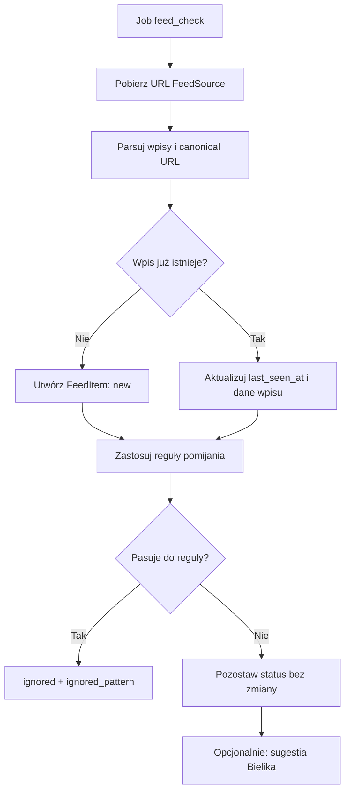
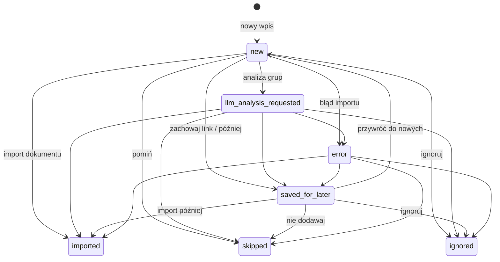
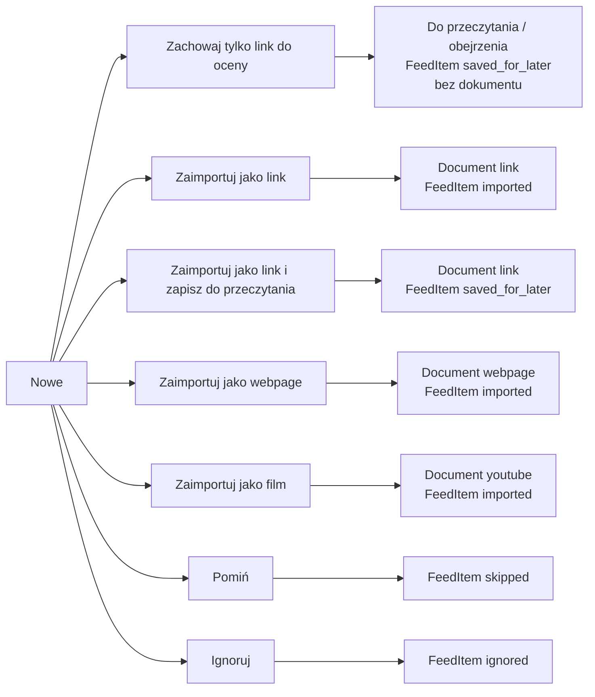
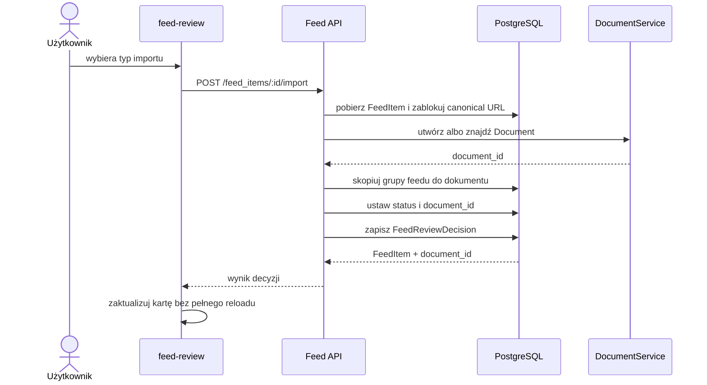
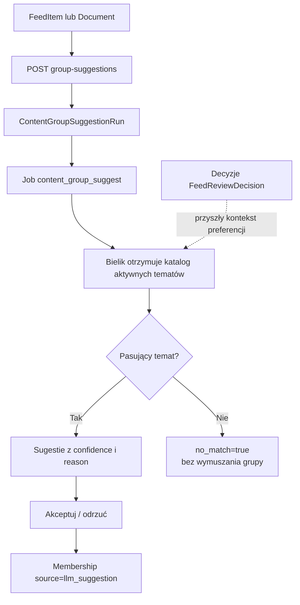
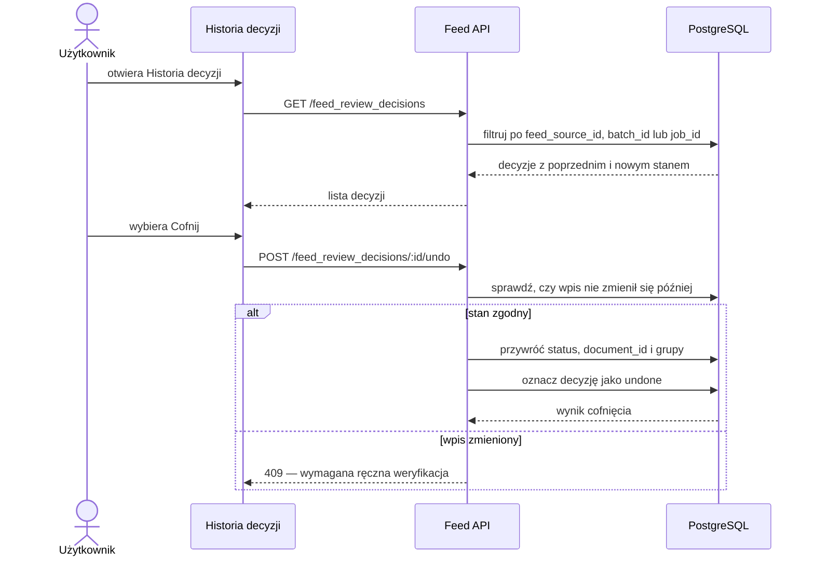

# Feed i `feed-review` — przepływy

Ten dokument opisuje aktualny przepływ materiałów z feedów: od pobrania wpisu, przez decyzję użytkownika, po import dokumentu, odłożenie do późniejszego przeglądu, ignorowanie i cofnięcie decyzji.

## Pojęcia

- `FeedSource` — konfiguracja źródła feedu.
- `FeedItem` — pojedynczy wpis znaleziony w feedzie; przechowuje URL, tytuł, daty, status i ewentualne powiązanie z dokumentem.
- `Document` — materiał zaimportowany do bazy, np. `link`, `webpage` albo `youtube`.
- `ContentGroup` — temat lub priorytet przypisany do wpisu albo dokumentu.
- `FeedReviewDecision` — zapis decyzji kuratorskiej, zawierający stan przed/po, batch, użytkownika i grupy.

## Pobieranie feedu

Feed nie tworzy dokumentu podczas samego sprawdzania źródła. Dokument powstaje dopiero po jawnej decyzji importu albo przez inny mechanizm importu.

## Lifecycle `FeedItem`

Status `saved_for_later` może oznaczać zarówno sam zachowany URL, jak i URL z już utworzonym dokumentem. Rozstrzyga to `document_id`.

## Decyzje w `feed-review`

| Przycisk | Dokument | Status po akcji | Późniejsza akcja |
|---|---|---|---|
| `Zachowaj tylko link do oceny` | nie | `saved_for_later` | przeczytaj, zaimportuj, pomiń albo ignoruj |
| `Zaimportuj jako link` | `link` | `imported` | dokument jest już zachowany w bazie |
| `Zaimportuj jako link i zapisz do przeczytania` | `link` | `saved_for_later` | dokument i wpis są w kolejce późniejszej |
| `Zaimportuj jako webpage` | `webpage` | `imported` | dokument trafia do dalszego przetwarzania |
| `Zaimportuj jako film` | `youtube` | `imported` | dokument trafia do dalszego przetwarzania |

Przykład: aktualizowana lista książek powinna użyć `Zachowaj tylko link do oceny`. Zachowujemy URL, nie pobieramy treści i później możemy wpis zignorować.

## Import dokumentu

Dla wariantu „link i zapisz do przeczytania” import tworzy dokument, ale końcowy status wpisu pozostaje `saved_for_later`.

## Grupy i sugestie Bielika

Bielik wybiera wyłącznie istniejące tematy. Priorytet, np. `Może kiedyś`, jest decyzją użytkownika i nie powinien być sugerowany jako temat.

## Historia i cofanie decyzji

Cofnięcie importu odłącza dokument od wpisu feedowego, ale nie usuwa dokumentu. Chroni to dokumenty używane także przez inne wpisy lub źródła.

## Najważniejsze endpointy

- `GET /feed_items` — kolejka wpisów według statusu i źródła.
- `POST /feed_items/:id/import` — import z `document_type`: `link`, `webpage`, `youtube`; opcjonalnie `keep_for_review=true`.
- `POST /feed_items/:id/save-for-later` — zachowanie samego wpisu/URL w kolejce późniejszej.
- `POST /feed_items/:id/ignore` — ignorowanie według wzorca URL albo tytułu.
- `POST /feed_items/:id/restore` — przywrócenie do `new`.
- `GET /feed_review_decisions` — historia decyzji z filtrami `feed_source_id`, `batch_id`, `job_id`.
- `POST /feed_review_decisions/:id/undo` — bezpieczne cofnięcie pojedynczej decyzji.

## Dane audytowe użyteczne dla LLM

Każda decyzja zawiera m.in. statusy przed/po, grupy przed/po, `action`, `metadata`, `user_id`, `batch_id`, opcjonalny `job_id`, czas i informację o cofnięciu. Pozwala to później budować kontekst preferencji użytkownika. Cofnięte decyzje powinny być wykluczane albo oznaczane osobno podczas tworzenia takiego kontekstu.
