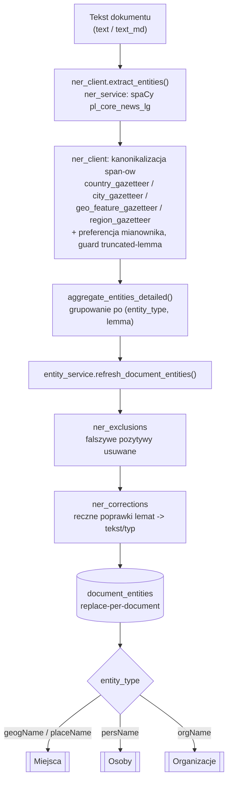
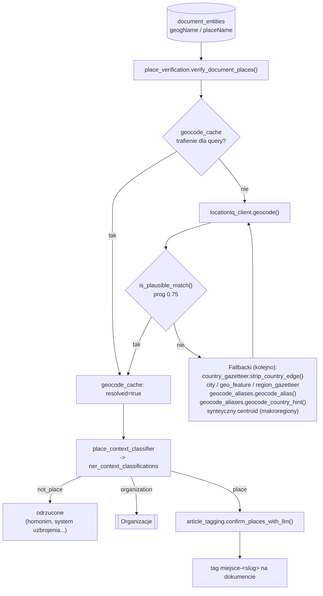
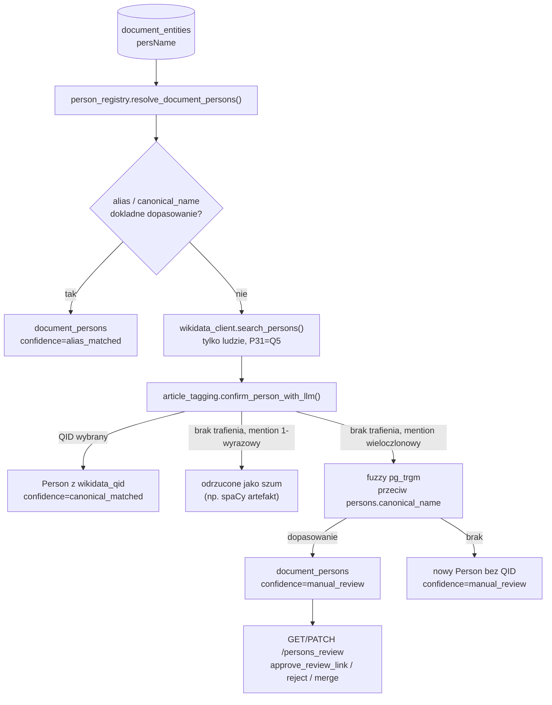
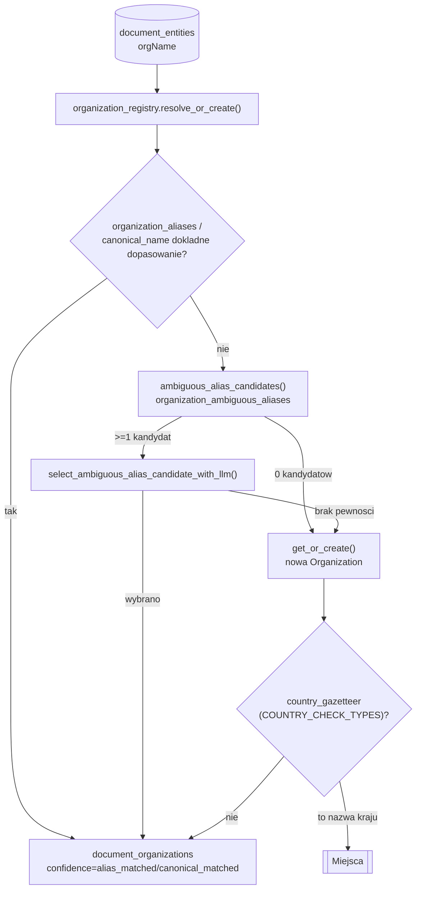

# Dziennik przypadków — diagnoza encji NER (miejsca / osoby / organizacje)

## Cel dokumentu

To osobny, **chronologiczny zapis zdiagnozowanych przypadków** —
uzupełnienie, nie duplikat, tabel z Etapu 2 workflow
[`docs/agent/entity-diagnose-workflow.md`](agent/entity-diagnose-workflow.md).
Różnica:

- tabele Etapu 2 opisują **obecny stan mechanizmu** ("ten objaw dziś
  naprawia ten kod") i są nadpisywane, gdy mechanizm się zmienia,
- ten dziennik to **historia decyzji**, wpis po wpisie, nigdy nie
  nadpisywany — materiał źródłowy do prezentacji "jakie błędy popełnia
  automatyczne rozpoznawanie miejsc/osób/organizacji" oraz pełny ślad
  audytowy, gdy tabele Etapu 2 zostaną z czasem skrócone.

Workflow (Etap 7) ma dopisywać tu jeden wpis po każdej zakończonej
diagnozie — patrz szablon niżej. Dokument został założony 2026-08-23
i zasiany 14 rzeczywistymi przypadkami z historii PR #517–#545 (dokument
#9394 — bieżące relacjonowanie wojny w Sudanie — jako główny poligon).

**Wersja prezentacyjna:** ta sama treść (diagramy, taksonomia, wybór
przypadków) jest też dostępna jako Claude Artifact "Pole minowe NER":
<https://claude.ai/code/artifact/27271269-5724-47d2-b39c-dba0fe94dac6>.
**Artefakt jest prywatny** (widoczny tylko dla autora tego repo, nie
publiczny) i służy wyłącznie do własnych prezentacji — nie jest
aktualizowany automatycznie razem z tym dokumentem; przed użyciem sprawdź,
czy nie przybyły nowe wpisy w dzienniku poniżej od czasu ostatniej
aktualizacji artefaktu.

## Architektura: od tekstu do encji w bazie

**Uwaga: brak automatycznego narzędzia do generowania tego diagramu.**
Poniższe grafy są utrzymywane ręcznie na podstawie kodu i muszą być
poprawiane przy każdej zmianie pipeline'u (patrz Etap 6 workflow — ten sam
PR, który zmienia mechanizm, powinien poprawić i diagram, jeśli zmienia
przepływ, a nie tylko treść tabeli).

### Wspólny etap ekstrakcji (wszystkie typy encji)



### Miejsca (`geogName` / `placeName`)



### Osoby (`persName`)



### Organizacje (`orgName`)



## Cache i tabele pomocnicze — przegląd

### Tabele w bazie (PostgreSQL)

| Tabela | Rola | Kto zapisuje | Kto odczytuje |
|---|---|---|---|
| `document_entities` | zagregowane encje NER per dokument, replace-per-document | `entity_service.refresh_document_entities()` | `/read`, wejście do resolucji miejsc/osób/organizacji |
| `geocode_cache` | pamięć podręczna odpowiedzi geokodera per query string, **łącznie z wynikami negatywnymi** — nazwa nigdy nie idzie do LocationIQ dwa razy | `locationiq_client.geocode()` wywoływane z `place_verification.py` | `place_verification.py` przed każdym nowym zapytaniem |
| `ner_context_classifications` | werdykt LLM dla niejednoznacznej encji (`persName`/`geogName`/`placeName`): `place` / `not_place` / `organization` + `rationale`/`context_excerpt` | `place_context_classifier.py` / person context classifier | diagnoza (Etap 2b), audyt decyzji LLM |
| `ner_temporal_candidates` | surowe wzmianki dat/czasu przed interpretacją osi czasu | ekstrakcja dat | `timeline_events` |
| `ner_exclusions` | globalny/scoped słownik fałszywych pozytywów spaCy — usuwa encję całkowicie | ręcznie, `POST /ner_exclusions` | `entity_service.py` przy każdym refreshu, przed korektami |
| `ner_corrections` | ręcznie kuratorowany, kluczowany po lemacie słownik korekt tekst/typ, z `reason`/`approved_by` | ręcznie, `POST /ner_corrections` | `ner_corrections.py`, tuż po `ner_exclusions` |
| `ner_correction_applications` | niemutowalny log każdego faktycznego zadziałania reguły z `ner_corrections` | automatycznie przy zastosowaniu reguły | audyt "gdzie i kiedy zadziałała reguła" |
| `persons` / `person_aliases` | globalny rejestr osób + kanoniczne aliasy/pseudonimy | `person_registry.py` | `resolve_document_persons()`, wyszukiwanie `/persons` |
| `document_persons` | link dokument↔osoba, `confidence` + `review_status` | `person_registry.py` | panel encji, kolejka `/persons_review` |
| `organizations` / `organization_aliases` | globalny rejestr organizacji + aliasy (`normalized_alias` **globalnie unikalny** — jeden alias nigdy nie wskazuje dwóch organizacji) | `organization_registry.py` | `resolve_or_create()`, panel Organizations |
| `organization_ambiguous_aliases` | jeden alias → **wiele** możliwych organizacji (celowo NIE globalnie unikalny), z `context_hint`/`status` | ręcznie (migracja/manual), np. seed "Africa Corps" | `select_ambiguous_alias_candidate_with_llm()` |
| `document_organizations` | link dokument↔organizacja, `confidence` + `review_status` | `organization_registry.py` | panel encji |

### Zamknięte listy w kodzie (NIE tabele bazodanowe)

Te moduły to ręcznie kuratorowane, zamknięte listy w repo — poprawka
zawsze idzie przez PR, nie przez REST/SQL na NAS:

| Moduł | Zawartość |
|---|---|
| `library/country_gazetteer.py` | ~190 państw ONZ/obserwatorów + Tajwan/Kosowo, dopasowanie po rdzeniu słowa |
| `library/city_gazetteer.py` | zamknięta lista miast (dziś głównie konflikt sudański) — kanonikalizacja jednowyrazowych nazw obcojęzycznych |
| `library/geo_feature_gazetteer.py` | morza/cieśniny/zatoki/kanały (~24 wpisy) |
| `library/region_gazetteer.py` | zagraniczne regiony administracyjne/stany (np. Kordofan) |
| `library/geocode_aliases.py` | `geocode_alias()` (transliteracja/inna pisownia w OSM) + `geocode_country_hint()` (bias przez `countrycodes`) + syntetyczne centroidy makroregionów geopolitycznych |

## Taksonomia przyczyn błędów

| Kod | Kategoria | Mechanizm | Przykład | Referencja |
|---|---|---|---|---|
| T1 | Sklejony span NER | Brak przecinka/kropki w źródle → spaCy łączy dwie sąsiednie encje w jeden span | "Al-Faszirze Emiraty" | E006, E007 |
| T2 | Zgubiona odmiana w lemacie (`Span.lemma_`) | spaCy konkatenuje lematy per-token, gubi zgodność przymiotnik-rzeczownik w nazwach wieloczłonowych | "Morze Czerwone" → lemat "Morze czerwony" | E001, E009, E013 |
| T3 | Brak nominatiwu w tekście / rzadka nazwa obcojęzyczna | Nazwa występuje tylko w przypadku zależnym, gazetteer/geokoder nie rozpoznaje odmiany | "Omdurmanie" | E002, E009 |
| T4 | Homonim geograficzny | Nazwa pokrywa się z inną, niepowiązaną, lepiej zindeksowaną lokalizacją | "Kosti" → zamek "Kost" (Czechy) | E011 |
| T5 | Inna transliteracja w OSM | LocationIQ/OSM indeksuje miejsce pod inną (np. angielską) pisownią | "Al-Faszir" → "El Fasher" | E004, E005 |
| T6 | Metonimia instytucjonalna | Nazwa siedziby władzy oznacza w tekście instytucję, nie fizyczne miejsce | "Biały Dom", "Kreml" | E012 |
| T7 | Region geopolityczny bez punktowej lokalizacji | Pojęcie geopolityczne, brak jednego wiarygodnego geokodowalnego punktu | "Sahel", "Bliski Wschód" | E010 |
| T8 | Rzeczownik pospolity jako nazwa własna | spaCy błędnie oznacza rzeczownik pospolity (zwł. na początku zdania) jako `geogName`/`placeName` | "Lotnisko w Chartumie..." | E008 |
| T9 | Fałszywy pozytyw spaCy / artefakt segmentacji | Fragment tekstu (artefakt STT, oderwany prefiks) błędnie oznaczony jako encja | osierocone "Al-" | E014 |
| T10 | Niejednoznaczna nazwa organizacji (kolizja) | Ta sama nazwa/skrót oznacza różne, niepowiązane organizacje | "Africa Corps" (Rosja 2023+) vs "Afrika Korps" (III Rzesza) | E003 |
| T11 | Stare dane pod już naprawionym mechanizmem | Rekord powstał przed wdrożeniem poprawki; obecny kod poprawnie obsługuje ten kształt danych | Organization 485 (ECFR) | E013 |

Jeśli nowy przypadek nie pasuje do żadnej kategorii, dopisz nowy kod (T12,
...) zamiast naciągać istniejącą.

## Szablon wpisu

Kopiuj poniższy blok dla każdego nowego przypadku (Etap 7 workflow).
Numeruj kolejno (`E015`, `E016`, ...).

```markdown
### E0NN — <krótki tytuł> (dok. #<id albo "n/d">, PR #<nr albo "n/d">, <data>)

- **Typ encji:** geogName / placeName / persName / orgName
- **Kategoria:** T<n> — <nazwa kategorii z taksonomii, albo nowa>
- **Zdanie źródłowe:** "<dokładny cytat z document_chunks, Etap 1>"
- **Objaw:** <co użytkownik zobaczył w /read albo panelu encji>
- **Przyczyna źródłowa:** <który mechanizm/plik/funkcja zawiódł;
  albo: stare dane pod mechanizmem X naprawionym w PR #Y — Etap 2b>
- **Poprawka:** kod / dane / oba — <plik i funkcja albo tabela
  i operacja REST/SQL>
- **Test regresyjny:** `<ścieżka do testu>` (albo "brak — czysto danowa
  poprawka, sam wpis w ner_exclusions/ner_corrections dokumentuje przypadek")
- **Status:** żywy bug naprawiony w kodzie / stare dane naprawione pod już
  naprawionym mechanizmem / tylko dane bez zmiany kodu
```

## Dziennik przypadków

### E001 — Zgubiona odmiana w lemacie: "Morze Czerwone" / "Zjednoczone Emiraty Arabskie" (dok. n/d, PR #517, 2026-08-14)

- **Typ encji:** geogName/placeName oraz orgName (kraj błędnie otagowany jako organizacja)
- **Kategoria:** T2
- **Zdanie źródłowe:** przypadek ogólny, zweryfikowany na żywym dokumencie zawierającym oba warianty naraz; nazwa "Morze Czerwone" → lemat "Morze czerwony", "Zjednoczone Emiraty Arabskie" → lemat "Zjednoczyć Emirat Arabski" i błędny typ `orgName`.
- **Objaw:** `entity_text` w `/read` pokazywał gramatycznie niepoprawną, częściowo małoliterową frazę zamiast nazwy własnej.
- **Przyczyna źródłowa:** `Span.lemma_` spaCy konkatenuje lematy per-token i gubi zgodność przymiotnik-rzeczownik dla wieloczłonowych `geogName`/`placeName`/`orgName`.
- **Poprawka:** kod — sześć uzupełniających się zmian: `ner_client.py` (preferencja formy w mianowniku nad zepsutym lematem), `country_gazetteer.py` (dodano krótką formę "Emiraty Arabskie"), rozszerzenie sprawdzania kraju na `orgName`, `place_verification.py`/`entity_service.py` (przemianowanie po geokodowaniu + fizyczny merge zbieżnych wierszy), nowy `library/ner_corrections.py` jako ręczna siatka bezpieczeństwa.
- **Test regresyjny:** `test_ner_client.py`, `test_place_verification.py`
- **Status:** żywy bug naprawiony w kodzie.

### E002 — Jednowyrazowe miasta obcojęzyczne: "Omdurman", "Port Sudan" (dok. #9394, PR #525)

- **Typ encji:** geogName/placeName
- **Kategoria:** T3
- **Zdanie źródłowe:** "...w Omdurmanie..." (miasto wspomniane tylko w przypadku zależnym)
- **Objaw:** `geocode_cache.resolved=false` dla "Omdurmanie"; ten sam wzorzec dla "Port Sudanu"/"Port Sudanem".
- **Przyczyna źródłowa:** preferencja mianownika w `ner_client.py` działała tylko dla nazw wieloczłonowych — pojedyncze słowo w rzadkim przypadku zależnym nie miało z czego się skanonikalizować, więc do geokodera trafiała forma odmieniona.
- **Poprawka:** kod — nowy `library/city_gazetteer.py` (zamknięta lista miast konfliktu sudańskiego), wpięty w kanonikalizację `ner_client.py`; backfill `imports/fix_city_names.py`. Naprawiono też pokrewny bug: `is_gazetteer_match` chroni trafienie gazetteeru przed odrzuceniem przez `_is_truncated_lemma`.
- **Test regresyjny:** `test_city_gazetteer.py`
- **Status:** żywy bug naprawiony w kodzie + backfill danych.

### E003 — "Africa Corps" vs "Afrika Korps" — kolizja nazw organizacji (dok. n/d — seed rejestru, PR #517 / migracja `fa12f5be1ae2`)

- **Typ encji:** orgName
- **Kategoria:** T10
- **Zdanie źródłowe:** n/d — seed danych rejestru, nie diagnoza pojedynczego dokumentu.
- **Objaw:** mechanizm rozstrzygania kolizji przez LLM (`organization_ambiguous_aliases` + `select_ambiguous_alias_candidate_with_llm`) działał wcześniej tylko dla krótkich skrótów pisanych wielkimi literami (np. "RSF"). Pełna nazwa wieloczłonowa zawsze szła deterministyczną ścieżką `canonical_name`, więc "Africa Corps" zawsze trafiałoby do tej samej organizacji bez sprawdzenia kontekstu zdania.
- **Przyczyna źródłowa:** `entity_service.py` nie wywoływał sprawdzenia niejednoznaczności dla nazw innych niż krótkie skróty.
- **Poprawka:** kod — `entity_service.py` wywołuje `ambiguous_alias_candidates()` dla każdej wzmianki `orgName` niezależnie od kształtu nazwy (sprawdzenie jest tanie i nic nie zmienia, dopóki kolizja nie została jawnie skuratorowana); migracja `fa12f5be1ae2` zasiewa kolizję "Africa Corps" — rosyjska formacja paramilitarna 2023+ podległa rosyjskiemu MON, faktyczny następca Grupy Wagnera, vs niemiecki *Afrika Korps* z II wojny światowej — jako dwie osobne organizacje + wpis w `organization_ambiguous_aliases` z `context_hint`.
- **Test regresyjny:** `test_organization_registry.py` (przypadki SAF jako wzorzec + Africa Corps)
- **Status:** żywy bug naprawiony w kodzie (rozszerzenie istniejącego mechanizmu na nowy kształt danych).

### E004 — Geokodowanie "Al-Faszir" przez alias angielski/OSM (dok. #9394, PR #533)

- **Typ encji:** geogName/placeName
- **Kategoria:** T5
- **Zdanie źródłowe:** wzmianka miasta "Al-Faszir" w polskiej pisowni.
- **Objaw:** LocationIQ nie rozwiązywał polskiej pisowni "Al-Faszir" — zapytanie trafiało w niepowiązaną uliczkę w Kairze zamiast czystego miss.
- **Przyczyna źródłowa:** OSM indeksuje miasto pod angielską transliteracją "El Fasher"/"Al Fashir" (inne "sh"/"f" niż polskie "sz").
- **Poprawka:** kod — nowy `library/geocode_aliases.py`; `place_verification._get_or_create_geocode()` próbuje alias dopiero po nieudanym `is_plausible_match()` na polskim zapytaniu, a trafienie relabeluje z powrotem na oryginalne polskie query, żeby pisownia encji/tagów nigdy nie wyciekła angielskiego aliasu.
- **Test regresyjny:** `test_geocode_aliases.py`
- **Status:** żywy bug naprawiony w kodzie.

### E005 — Próg dopasowania dla aliasu Al-Faszir (dok. #9394, PR #534)

- **Typ encji:** geogName/placeName
- **Kategoria:** T5 (doprecyzowanie E004)
- **Zdanie źródłowe:** j.w. (E004)
- **Objaw:** zapytanie z aliasem "El Fasher, Sudan" wciąż nie przechodziło `is_plausible_match()` (wynik 0.64 < próg 0.75).
- **Przyczyna źródłowa:** dopisanie sufiksu kraju do zapytania obniżało wynik dopasowania string-vs-part, mimo że sam "El Fasher" bez kraju dawał 0.89 i trafiał we właściwy węzeł OSM — zweryfikowane ręcznie na żywym LocationIQ.
- **Poprawka:** kod — usunięcie sufiksu kraju z aliasu w `geocode_aliases.py`.
- **Test regresyjny:** `test_geocode_aliases.py` (rozszerzony)
- **Status:** żywy bug naprawiony w kodzie.

### E006 — "Al-Faszirze Emiraty" — sklejony span (dok. #9394, PR #535)

- **Typ encji:** geogName/placeName
- **Kategoria:** T1
- **Zdanie źródłowe:** "...w Al-Faszirze. Emiraty miały..." (brak przecinka między zdaniami)
- **Objaw:** geokodowanie poprawnie failowało na zlepionym tekście, ale zepsuty span nigdy nie był dzielony — wisiał jako unresolved w `document_entities` i pokazywał się w czytniku.
- **Przyczyna źródłowa:** spaCy scaliło miejsce z wiodącą nazwą kraju z następnego zdania w jeden span `geogName`/`placeName`.
- **Poprawka:** kod — `place_verification.py` retry'uje nieudane geokodowanie, sprawdzając czy brzeg `entity_text` to pełna wzmianka kraju (`country_gazetteer.strip_country_edge()`, reużycie istniejącego gazetteeru ~190 krajów), odcina go i kanonikalizuje resztę przez city/geo-feature gazetteer.
- **Test regresyjny:** `test_place_verification.py`, `test_country_gazetteer.py`
- **Status:** żywy bug naprawiony w kodzie. Przypadek referencyjny workflow (Etap Cel).

### E007 — Samodzielny demonim "saudyjski" nie odcinał się od sklejonego span-u (dok. #9394, PR #537)

- **Typ encji:** geogName/placeName
- **Kategoria:** T1 (doprecyzowanie E006)
- **Zdanie źródłowe:** "...wizyty w Białym Domu saudyjski książę koronny..." (brak przecinka po "Domu")
- **Objaw:** zlepiony span "Białym Domu saudyjski" nie odzyskiwał się przez `_retry_after_stripping_country()`.
- **Przyczyna źródłowa:** "Arabia Saudyjska" miała w gazetteerze tylko dwuczłonowy wariant frazowy ("arabi\* saudyjsk\*"); samodzielny przymiotnik "saudyjski" nigdy nie dawał pełnego dopasowania.
- **Poprawka:** kod — `country_gazetteer.py` rozpoznaje teraz też samodzielny demonim jako brzeg do odcięcia.
- **Test regresyjny:** `test_country_gazetteer.py`
- **Status:** żywy bug naprawiony w kodzie.

### E008 — "Lotnisko" jako geogName (dok. #9394, PR #538)

- **Typ encji:** geogName/placeName
- **Kategoria:** T8
- **Zdanie źródłowe:** "Lotnisko w Chartumie wciąż nie obsługuje..."
- **Objaw:** LocationIQ trafił w niepowiązane miejsce o tej samej nazwie (dzielnica Warszawy); `confirm_places_with_llm` nie złapał niedopasowania, bo widzi tylko tekst powierzchniowy, nie tożsamość rozwiązanego miejsca.
- **Przyczyna źródłowa:** spaCy oznaczyło rzeczownik pospolity na początku zdania jako samodzielną nazwę własną — ten sam mechanizm co istniejące wpisy `ner_exclusions` dla "kraj"/"unia"/"Teza".
- **Poprawka:** tylko dane — `POST /ner_exclusions` (id=15), bez zmiany kodu.
- **Test regresyjny:** brak — wpis w `ner_exclusions` jest samodokumentujący.
- **Status:** tylko dane, bez zmiany kodu.

### E009 — "Kordofanu Północnego" — region w dopełniaczu (dok. #9394, PR #539)

- **Typ encji:** geogName/placeName
- **Kategoria:** T2 / T3
- **Zdanie źródłowe:** jedyna wzmianka w dokumencie, w dopełniaczu, nigdy w mianowniku.
- **Objaw:** nierozwiązany zepsuty lemat wysłany do LocationIQ trafiał w niepowiązaną warszawską stację wodociągów (poprawnie odrzuconą przez `is_plausible_match()`), zostawiając realny sudański stan nierozwiązanym.
- **Przyczyna źródłowa:** ten sam bug zgubionej odmiany co miasta/cechy geograficzne (T2), ale dla trzeciej kategorii nazw — regionów administracyjnych/stanów — dotąd nieobjętej żadnym gazetteerem.
- **Poprawka:** kod — nowy `library/region_gazetteer.py` (ten sam wzorzec zamkniętej listy co jego dwaj sąsiedzi), wpięty do agregacji w `ner_client.py` i do fallbacku odcinania kraju w `place_verification.py`.
- **Test regresyjny:** `test_region_gazetteer.py`
- **Status:** żywy bug naprawiony w kodzie.

### E010 — Syntetyczne geokodowanie makroregionów: Sahel, Bliski Wschód (dok. #9394, PR #540)

- **Typ encji:** geogName/placeName
- **Kategoria:** T7
- **Zdanie źródłowe:** wzmianka "Sahel" — w rzeczywistości konkretna prowincja Burkina Faso, ale użyta w tekście jako region geopolityczny.
- **Objaw:** żywe zapytanie albo trafiało fałszywie w niepowiązane miejsce o tej samej nazwie ("Kaukaz" → polska wieś, "Bliski Wschód" → warszawska restauracja), albo w ogóle nie trafiało (poprawnie odrzucone przez `is_plausible_match()`).
- **Przyczyna źródłowa:** regiony geopolityczne nawracające w reportażu (Sahel, Bliski Wschód...) nie mają jednego wiarygodnego geokodowalnego punktu w LocationIQ.
- **Poprawka:** kod — nowy zamknięty gazetteer kanonikalizujący te nazwy w NER; `place_verification.py` syntetyzuje przybliżony centroid zamiast w ogóle pytać LocationIQ.
- **Test regresyjny:** `test_place_verification.py` (przypadek syntetycznego centroidu)
- **Status:** żywy bug naprawiony w kodzie (nowa funkcjonalność, nie tylko fix).

### E011 — "Kosti" przegrywa ranking z zamkiem "Kost" w Czechach (dok. #9394, PR #541)

- **Typ encji:** geogName/placeName
- **Kategoria:** T4
- **Zdanie źródłowe:** wzmianka "Kosti" (stolica stanu Biały Nil, Sudan).
- **Objaw:** bare-query ranking LocationIQ faworyzuje niepowiązany zamek; trafienie poprawnie odrzucone przez allowlistę klas OSM w `is_plausible_match()`, ale bez dalszego retry.
- **Przyczyna źródłowa:** zapytanie z dopisanym krajem ("Kosti, Sudan") zwraca właściwe trafienie, ale traci na tym samym problemie ze scoringiem string-vs-part co Al-Faszir/El Fasher (E005).
- **Poprawka:** kod — nowa `geocode_country_hint()` obok `geocode_alias()` w `geocode_aliases.py`; `countrycodes` przekazywany jako osobny parametr API LocationIQ (obciąża ranking, nie dotyka tekstu zapytania porównywanego w `is_plausible_match()`), wpięty jako trzeci fallback w `place_verification.py`.
- **Test regresyjny:** `test_geocode_aliases.py`
- **Status:** żywy bug naprawiony w kodzie.

### E012 — "Biały Dom" / "Kreml" jako organizacja, nie miejsce (dok. #9394 / #9345, PR #542)

- **Typ encji:** geogName/placeName → przetypowane na orgName
- **Kategoria:** T6
- **Zdanie źródłowe:** "wizyta w Białym Domu" (#9394); "Na Kremlu rozumieją, że..." (#9345)
- **Objaw:** metonimiczne wzmianki siedziby władzy utykały na zawsze jako nierozwiązane `geogName` — najlepsze dopasowanie LocationIQ dla gołej nazwy siedziby rządu to zwykle niepowiązany budynek gdzie indziej (Moskwa dla "Biały Dom", czeska restauracja dla "Kremlu"), poprawnie odrzucane przez `is_plausible_match()`.
- **Przyczyna źródłowa:** klasyfikator kontekstu miejsc miał tylko dwa werdykty (`place`/`not_place`) — nie rozpoznawał trzeciej kategorii: metonimii instytucjonalnej.
- **Poprawka:** kod — `place_context_classifier.py` zyskuje trzeci werdykt `organization` i działa też nad kandydatami, które w ogóle się nie zgeokodowały. Wysokopewny werdykt `organization` przepisuje typ encji na `orgName` i rozwiązuje przez istniejący globalny `organization_registry.py` (ten sam rejestr, do którego trafiają Kreml/Pentagon, gdy spaCy sam otaguje wzmiankę jako `orgName`), scalając z istniejącym wierszem `orgName` zamiast łamać unikalny constraint `entity_type`/`entity_text`.
- **Test regresyjny:** regresje wprost dla obu dokumentów — #9394 zostaje miejscem (bez reklasyfikacji, literalna wizyta), #9345 jest przepisany i trafia do rejestru organizacji.
- **Status:** żywy bug naprawiony w kodzie.

### E013 — Organizacja 485 (ECFR) — canonical_name to surowy zepsuty lemat (dok. #9394, PR #543 — przykład Etapu 2b)

- **Typ encji:** orgName
- **Kategoria:** T11 (stare dane) — pierwotna przyczyna T2
- **Zdanie źródłowe:** jedyna wzmianka "Europejskiej Rady Spraw Zagranicznych" w dopełniaczu.
- **Objaw:** Organization 485 utworzona 2026-08-14 z `canonical_name` = "europejski rada sprawa zagraniczny" — surowy, zepsuty lemat spaCy.
- **Przyczyna źródłowa:** rekord powstał tydzień przed wdrożeniem poprawki Faza 1/5 (E001, PR #517), która rozszerzyła preferencję formy w mianowniku na wzmianki `orgName` występujące wyłącznie w dopełniaczu. Mechanizm w obecnym kodzie już poprawnie obsługuje ten kształt danych (identycznie jak istniejące testy dla sił zbrojnych Sudanu) — to **nie** żywy bug.
- **Poprawka:** brak zmiany kodu; utrwalono dokładny rzeczywisty kształt danych jako test regresyjny, żeby przyszła regresja mechanizmu została złapana.
- **Test regresyjny:** `test_ner_client.py` (nowy przypadek w istniejącej rodzinie testów preferencji mianownika)
- **Status:** tylko dane / stare dane pod już naprawionym mechanizmem — podręcznikowy przykład procedury Etapu 2b workflow.

### E014 — Osierocony prefiks "Al-" jako placeName (dok. #9394, PR #545)

- **Typ encji:** geogName/placeName (fałszywy pozytyw)
- **Kategoria:** T9
- **Zdanie źródłowe:** "Omara al-Baszira" — spaCy rozbiło na `persName` "Baszir" (poprawnie rozwiązane) + osobny fragment "Al-" otagowany jako `placeName`, najprawdopodobniej "zagruntowany" przez wzmianki "Al-Faszir"/"Al-Ubajid" gdzie indziej w tym samym dokumencie.
- **Objaw:** bezsensowny, kilkuznakowy fragment "Al-" widoczny w panelu miejsc.
- **Przyczyna źródłowa:** fałszywy pozytyw spaCy — artefakt segmentacji arabskiego przedrostka, sprzyjany przez gęstość podobnych nazw własnych w tym samym dokumencie.
- **Poprawka:** tylko dane — nowa globalna reguła `ner_exclusions` (id=16, `POST /ner_exclusions`); zepsuta encja w dokumencie (`document_entities.id=13026`) usunięta przez `DELETE /website_entities/13026`.
- **Test regresyjny:** regresja dodana jako test dokumentujący dokładnie ten przypadek (bez zmiany kodu produkcyjnego).
- **Status:** tylko dane, bez zmiany kodu.
